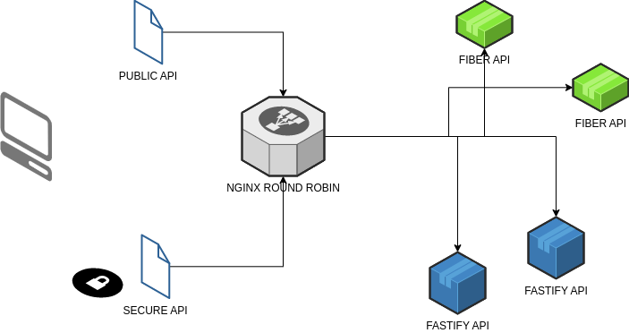

# MINUS NA PLUS API
* [HOME PAGE](https://minus-na-plus.nabank.tech)
https://minus-na-plus.nabank.tech

* [SWAGGER DOC](https://minus-na-plus.nabank.tech/swagger)


# Create a Hetzner snapshot using Packer - provisioning using Ansible

The snapshot can then be used to quickly stand a cluster using Terraform

You can customize the Ansible playbook to do more customisations.

## Usage IaC
* Install [Packer](https://www.packer.io/docs/install) and [Ansible](https://docs.ansible.com/ansible/latest/installation_guide/intro_installation.html)
* Get an API token from Hetzner Cloud
* Set Hetzner token environment variable `export HCLOUD_TOKEN=xxx`
* Customize packer.json
* Customize the Ansible playbook
* Run packer to create the snapshot

```bash
deploy_user_name
packer build packer.json

```
## API
This is a simple API with mathematical operations designed to test Fiber(go) & Node with Github actions. Additionally, it serves as a proof of concept for testing the performance of the Node Fastify vs Golang Fiber framework.


### Localhost API Requests
```bash
curl http://erdos.localhost/v1/api/hello
```
### Public API Requests
```bash
curl https://minus-na-plus.nabank.tech/v1/api/hello
```
### Secure API Requests
* Adds two numbers together.
* /add ``` GET: curl --cookie "token=public-key-123" "https://minus-na-plus.nabank.tech/v1/api/add?x=0&y=1" ```
*  Subtracts the second number from the first.
* /sub ``` GET: curl --cookie "token=public-key-123" "https://minus-na-plus.nabank.tech/v1/api/sub?x=4&y=2" ```
*  Multiplies two numbers together.
* /mul ``` GET: curl --cookie "token=public-key-123" "https://minus-na-plus.nabank.tech/v1/api/mul?x=5&y=3" ```
* Multiplies two numbers together.
* /div ``` GET: curl --cookie "token=public-key-123" "https://minus-na-plus.nabank.tech/v1/api/div?x=10&y=2" ```
* Returns the mathematical constant e.
* /e ``` GET: curl --cookie "token=public-key-123" "https://minus-na-plus.nabank.tech/v1/api/e" ```

####  Interested? You can find more information about the API on [SWAGGER DOC](https://minus-na-plus.nabank.tech/swagger).

## Usage of Docker Compose Template
This repository contains templates for generating Docker Compose files for different services. These templates are written in Ruby's Embedded Ruby (ERB) syntax, allowing you to easily customize the Compose file by changing the variables in the templates.

### How to Use
* Modify the default variables in the create_compose.rb script to your desired values.
* Run the create_compose.rb script to generate the Docker Compose file with the specified variables.
* Use the generated Compose file to start up your Dockerized services.


```bash
ruby create_compose.rb > compose.yaml
```

```bash
❯ ruby create_compose.rb --name1 my-app --tag1 v1.0 > compose.yaml
version: '3'

services:
  erdos-proxy:
      build: ./_devops/nginx
      image: my-app:v1.0
      depends_on:
        erdos-fiber:
          condition: service_started
      volumes:
          - ./_devops/config/local.conf:/etc/nginx/conf.d/site.conf
          - ./nginx-log:/var/log/nginx
          - ./_devops/config/ssl_cert/local:/ssl
          - ./front_app:/var/www/vhosts/front_app/
      links:
          - erdos-fiber
          - erdos-node
      container_name: erdos-proxy
      ports:
        - "80:80"
      restart: always
  erdos-fastify:
      image: marcin0/minus-na-plus:fastify
      build:
        context: ./_devops/node
        target: dev
      env_file: ./_devops/node/.env
      volumes:
        - ./fastify_api:/home/node/src/app
      container_name: erdos-node
      restart: always
  erdos-fiber:
      image: marcin0/minus-na-plus:fiber
      build:
        context: ./_devops/fiber
        target: dev
      volumes:
        - ./fiber_api:/usr/src
      container_name: erdos-fiber
      restart: always


```


[](https://minus-na-plus.nabank.tech)


